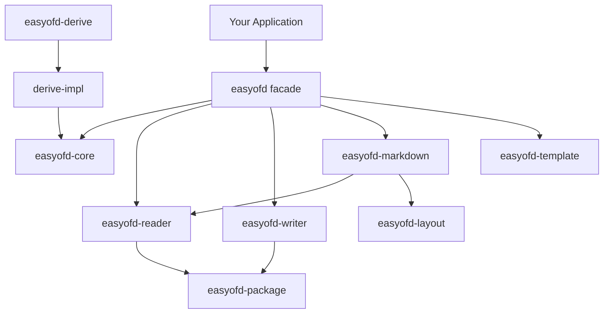

<a id="readme-top"></a>

<div align="center">

# easyofd-rust

**Idiomatic Rust OFD library — Builder pattern, compile-time derive, GB/T 33190-2016 compliant**

[](LICENSE)
[](https://www.rust-lang.org)
[](https://github.com/rust-secure-code/safety-dance)

[English](./README.md) · [简体中文](./README.zh-CN.md)

[Features](#features) · [Architecture](#architecture) ·
[Quick Start](#quick-start) · [API Reference](#api-reference) ·
[Design Principles](#design-principles) · [Roadmap](#roadmap) ·
[Contributing](#contributing)

</div>

---

> **Current version**: `0.1.0`<br>
> **MSRV**: Rust `1.88`<br>
> **Edition**: `2024`<br>
> **Workspace Resolver**: `3`<br>
> **License**: Apache-2.0

`easyofd-rust` provides a fluent, type-safe API for OFD (Open Fixed-layout Document) operations: **create**, **read**, **stream-write**, **template fill**, **edit**, and **OFD → Markdown** conversion. Digital signatures and PDF conversion are experimental/planned.

OFD is the Chinese national standard GB/T 33190-2016, widely used for electronic invoices, official documents, and archival purposes. Inspired by [Alibaba EasyExcel](https://github.com/alibaba/easyexcel).

---

## Features

| Feature | Status | Description |
|:---|:---:|:---|
| Create OFD | ✅ | Text, images, paths, metadata; fluent Builder API |
| `#[derive(OfdModel)]` | ✅ | Compile-time reflection; zero runtime cost |
| Stream Writer | ✅ | Page-by-page ZIP writing; constant memory per page |
| Editor | ✅ | Open → modify (add text, pages, watermarks) → save |
| Read OFD | ✅ | SAX-based parsing, page visitor, safe ZIP validation |
| OFD → Markdown | ✅ | Deterministic reading-order, image export, loss report |
| Template fill | ✅ | `{key}` placeholder replacement, binary-preserving |
| Atomic output | ✅ | Same-directory temp file + atomic rename |
| Digital signatures | ⚠️ | API complete, cryptographic signing is stub |
| PDF ↔ OFD | 🗓️ | API surface returns explicit not-implemented error |
| Vector paths | ✅ | hline, vline, rect with stroke/fill |
| Custom fonts | ⚠️ | Registration API only, no font resource generation yet |

---

## Architecture

```
easyofd-rust (12 crates)
├── easyofd             🎯 Facade — EasyOfd::write/read/to_markdown/fill_template
├── easyofd-core        🧩 Types, traits, errors, data model
├── easyofd-derive      ⚡ Proc-macro shim (6 lines)
├── easyofd-derive-impl ⚙️ All derive logic (400 lines)
├── easyofd-reader      📖 SAX-based OFD parsing + page visitor
├── easyofd-writer      ✍️ ZIP/XML generation + stream writer + editor
├── easyofd-package     🛡️ ZIP limits, safe paths, atomic replacement
├── easyofd-layout      📐 Deterministic reading-order analysis
├── easyofd-markdown    📝 Streaming OFD → Markdown + loss report
├── easyofd-template    📋 Placeholder replacement engine
├── easyofd-signature   🔐 GB/T 38540 electronic seals [experimental]
└── easyofd-convert     🧪 PDF ↔ OFD bridge API [planned]
```



See [docs/easyofd-rust-Architecture.zh_CN.md](docs/easyofd-rust-Architecture.zh_CN.md) for the full architecture document.

---

## Quick Start

```toml
[dependencies]
easyofd = "0.1"
```

### 1. Write with Derive Macro

```rust
use easyofd::{EasyOfd, OfdModel};

#[derive(OfdModel)]
#[ofd(page_width = 210.0, page_height = 297.0)]
struct Invoice {
    #[ofd(x = 20.0, y = 30.0, size = 18.0, bold)]
    title: String,
    #[ofd(x = 20.0, y = 50.0)]
    amount: String,
}

let data = vec![
    Invoice { title: "Invoice #001".into(), amount: "$100.00".into() },
    Invoice { title: "Invoice #002".into(), amount: "$200.00".into() },
];

EasyOfd::write::<Invoice>("invoices.ofd")
    .metadata_title("Monthly Invoices")
    .do_write(&data)?;
```

### 2. Manual Page Construction

```rust
use easyofd::{EasyOfd, TextObject, ImageObject, OfdPage};

let mut page = OfdPage::new(210.0, 297.0); // A4
page.add_text(TextObject::new(20.0, 30.0, "Hello OFD!").size(24.0).bold());
page.add_text(TextObject::new(20.0, 60.0, "Normal text"));
page.add_image(ImageObject::jpeg(150.0, 30.0, 30.0, 30.0, jpeg_bytes));

EasyOfd::write_pages_to("output.ofd", vec![page])?;
```

### 3. Stream Writer (Large Documents)

```rust
use easyofd::{EasyOfd, OfdPage, TextObject};

let file = std::fs::File::create("large.ofd")?;
let mut writer = EasyOfd::stream_writer(file);
for i in 1..=100_000 {
    let mut page = OfdPage::new(210.0, 297.0);
    page.add_text(TextObject::new(10.0, 10.0, format!("Page {i}")));
    writer.write_page(page)?;
}
writer.finish()?;
```

### 4. Read OFD

```rust
use easyofd::EasyOfd;

// Visitor pattern — pages are not retained in memory
let visited = EasyOfd::read_pages("input.ofd")
    .page_range(1, 10)
    .do_read(|page_number, page| {
        println!("Page {page_number}: {} objects", page.content.len());
        Ok(())
    })?;
```

### 5. OFD → Markdown

```rust
use easyofd::EasyOfd;

// In-memory
let result = EasyOfd::to_markdown("input.ofd").do_convert()?;
println!("{}", result.markdown);
println!("Pages: {}, Losses: {}", result.report.pages_converted, result.report.losses.len());

// Stream to file
use std::fs::File;
EasyOfd::to_markdown("input.ofd")
    .convert_to(File::create("output.md")?)?;
```

### 6. Template Fill

```rust
use easyofd::EasyOfd;
use std::collections::HashMap;

let mut data = HashMap::new();
data.insert("name".to_string(), "Alice".to_string());
data.insert("amount".to_string(), "$1,234.00".to_string());

EasyOfd::fill_template("template.ofd", &data)?.save("filled.ofd")?;
```

### 7. Edit Existing OFD

```rust
use easyofd::{OfdEditor, TextObject, Watermark};

let mut editor = OfdEditor::open("input.ofd")?;
editor.add_text_to_page(0, TextObject::new(10.0, 40.0, "Added text"))?;
editor.apply_watermarks(&[Watermark::text("CONFIDENTIAL").position(50.0, 150.0)]);
editor.save("edited.ofd")?;
```

---

## API Reference

### Entry Point

All operations go through `EasyOfd` static methods:

| Method | Returns | Purpose |
|---|---|---|
| `EasyOfd::write::<T>(path)` | `OfdWriterBuilder<T>` | Typed write with `OfdModel` |
| `EasyOfd::write_pages(path)` | `PageWriterBuilder` | Manual page write |
| `EasyOfd::write_pages_to(path, pages)` | `OfdResult<()>` | One-shot file write |
| `EasyOfd::write_pages_to_bytes(pages)` | `OfdResult<Vec<u8>>` | One-shot bytes |
| `EasyOfd::stream_writer(output)` | `OfdStreamWriter<W>` | Streaming write |
| `EasyOfd::read_pages(path)` | `OfdReadBuilder` | Page visitor |
| `EasyOfd::to_markdown(path)` | `MarkdownConversionBuilder` | Markdown conversion |
| `EasyOfd::fill_template(path, data)` | `OfdResult<OfdTemplateFiller>` | Template fill |

### Core Types

| Type | Purpose |
|---|---|
| `OfdPage` | A page with width, height, and content objects |
| `TextObject` | Positioned text with font, size, weight, color |
| `ImageObject` | Positioned image (JPEG/PNG/BMP/TIFF) |
| `PathObject` | Vector path (SVG-like `d` attribute) |
| `OfdModel` | Trait for mapping Rust structs to OFD pages |
| `OfdError` | Unified error enum (7 variants) |
| `ConversionReport` | Markdown conversion results + losses + warnings |

---

## Design Principles

| Principle | Implementation |
|---|---|
| **Zero unsafe** | `#![forbid(unsafe_code)]` across entire workspace |
| **Fluent Builders** | `mut self → Self` with `#[must_use]` |
| **Compile-time reflection** | `#[derive(OfdModel)]` — zero runtime cost |
| **Single facade** | `EasyOfd` — discoverable static factory |
| **GB/T 33190-2016** | Valid OFD ZIP with correct XML namespaces |
| **Single error type** | `OfdError` + `type OfdResult<T>` |
| **Streaming first** | Writer/Reader/Markdown all support page-by-page processing |
| **Separation of concerns** | Each crate has one job; facade wires them together |

---

## Workspace Structure

| Crate | Tests | Lines | Description |
|---|---:|---:|---|
| `easyofd` | 12 | 504 | Facade, Builders, re-exports |
| `easyofd-core` | 48 | 612 | Types, traits, errors |
| `easyofd-derive` | — | 6 | Proc-macro shim |
| `easyofd-derive-impl` | 34+2 | 400 | Derive logic + compile-fail |
| `easyofd-reader` | 12 | 844 | SAX parser + visitor |
| `easyofd-writer` | 62 | 1440 | Writer + StreamWriter + Editor |
| `easyofd-package` | 6 | 280 | ZIP safety + atomic I/O |
| `easyofd-layout` | 3 | 159 | Reading-order analysis |
| `easyofd-markdown` | 10 | 307 | OFD → Markdown |
| `easyofd-template` | 2 | 160 | Placeholder engine |
| `easyofd-signature` | 3 | 180 | Electronic seals [experimental] |
| `easyofd-convert` | 5 | 80 | PDF bridge [planned] |
| **Total** | **199** | **6128** | — |

---

## Benchmark

```bash
cargo run --release -p easyofd --example benchmark -- 10000
```

Output: JSON with page count, input size, read/write timings.

---

## Examples

| Example | Description | Run |
|---|---|---|
| `write_simple` | Create OFD with text, images, and paths | `cargo run --example write_simple` |
| `read_simple` | Read OFD and print page count + text | `cargo run --example read_simple` |
| `read_with_visitor` | Stream-read OFD page-by-page (visitor pattern) | `cargo run --example read_with_visitor` |
| `markdown_export` | Export OFD to Markdown with loss reporting | `cargo run --example markdown_export` |
| `signature_roundtrip` | GB/T 38540 sign → verify → tamper detection | `cargo run --example signature_roundtrip` |
| `action_uri` | Create OFD with URI hyperlinks (GB/T 33190 Ch.15) | `cargo run --example action_uri` |
| `annotation` | Create OFD with text/highlight/stamp annotations (Ch.16) | `cargo run --example annotation` |
| `batch_sign` | Batch sign multiple OFDs + multi-signer mode | `cargo run --example batch_sign` |
| `convert_pdf` | OFD → PDF conversion and PDF → OFD roundtrip | `cargo run --example convert_pdf` |
| `benchmark` | Performance benchmark (read/write/markdown) | `cargo run --release --example benchmark -- 10000` |

---

## Testing

```bash
# All tests
cargo test --workspace

# Clippy
cargo clippy --workspace -- -D warnings

# Compile-fail tests (derive macro error messages)
cargo test -p easyofd-derive-impl
```

---

## Roadmap

| Version | Milestone | Status |
|---|---|:---:|
| v0.1 | Writer + Derive + basic API | ✅ |
| v0.2 | Reader + Template + Package safety | ✅ |
| v0.3 | Signature API design | ✅ experimental |
| v0.4 | Convert API design | ✅ planned |
| v0.5 | Layout + Markdown + Editor + StreamWriter | ✅ |
| v0.6 | Cryptographic signing implementation | 🗓️ |
| v0.7 | PDF ↔ OFD conversion implementation | 🗓️ |

---

## Contributing

1. Fork and clone
2. `cargo test --workspace` — all tests must pass
3. `cargo clippy --workspace -- -D warnings` — no warnings
4. All new code must have `#[test]` coverage
5. No `unsafe` code — `#![forbid(unsafe_code)]` is enforced

---

## License

Apache-2.0. See [LICENSE](LICENSE).
