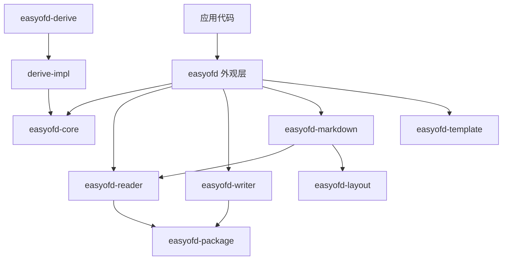

<a id="readme-top"></a>

<div align="center">

# easyofd-rust

**纯 Rust OFD 库 — Builder 模式、编译期派生宏、GB/T 33190-2016 合规**

[](LICENSE)
[](https://www.rust-lang.org)
[](https://github.com/rust-secure-code/safety-dance)

[English](./README.md) · [简体中文](./README.zh-CN.md)

[功能](#功能) · [架构](#架构) ·
[快速开始](#快速开始) · [API 参考](#api-参考) ·
[设计原则](#设计原则) · [路线图](#路线图) ·
[贡献](#贡献)

</div>

---

> **当前版本**：`0.1.0`<br>
> **MSRV**：Rust `1.88`<br>
> **Edition**：`2024`<br>
> **Workspace Resolver**：`3`<br>
> **许可证**：Apache-2.0

`easyofd-rust` 为 OFD（开放版式文档）操作提供流畅、类型安全的 API：**创建**、**安全读取**、**逐页流式写入**、**模板填充**、**编辑**和 **OFD → Markdown** 转换。电子签章和 PDF 转换为实验性/计划中功能。

OFD 是中国国家标准 GB/T 33190-2016，广泛用于电子发票、公文和档案。设计灵感来自 [Alibaba EasyExcel](https://github.com/alibaba/easyexcel)。

---

## 功能

| 功能 | 状态 | 描述 |
|:---|:---:|:---|
| 创建 OFD | ✅ | 文本、图片、路径、元数据；流畅 Builder API |
| `#[derive(OfdModel)]` | ✅ | 编译期反射；零运行时开销 |
| 流式 Writer | ✅ | 逐页写入 ZIP；每页内存恒定 |
| 编辑器 | ✅ | 打开 → 修改（添加文本、页面、水印）→ 保存 |
| 读取 OFD | ✅ | SAX 解析、页面 visitor、安全 ZIP 校验 |
| OFD → Markdown | ✅ | 确定性阅读顺序、图片导出、损失报告 |
| 模板填充 | ✅ | `{key}` 占位符替换，二进制保持 |
| 原子输出 | ✅ | 同目录临时文件 + 原子替换 |
| 电子签章 | ⚠️ | API 完整，密码学签名为 stub |
| PDF ↔ OFD | 🗓️ | API 返回明确的未实现错误 |
| 矢量路径 | ✅ | 水平线、垂直线、矩形，支持描边/填充 |
| 自定义字体 | ⚠️ | 仅注册 API，尚无字体资源生成 |

---

## 架构

```
easyofd-rust（12 个 crate）
├── easyofd             🎯 外观层 — EasyOfd::write/read/to_markdown/fill_template
├── easyofd-core        🧩 类型、trait、错误、数据模型
├── easyofd-derive      ⚡ proc-macro 薄入口（6 行）
├── easyofd-derive-impl ⚙️ 全部派生逻辑（400 行）
├── easyofd-reader      📖 基于 SAX 的 OFD 解析 + 页面 visitor
├── easyofd-writer      ✍️ ZIP/XML 生成 + 流式 Writer + 编辑器
├── easyofd-package     🛡️ ZIP 限制、安全路径、原子替换
├── easyofd-layout      📐 确定性阅读顺序分析
├── easyofd-markdown    📝 流式 OFD → Markdown + 损失报告
├── easyofd-template    📋 占位符替换引擎
├── easyofd-signature   🔐 GB/T 38540 电子签章 [实验性]
└── easyofd-convert     🧪 PDF ↔ OFD 桥接 API [计划中]
```



完整架构文档见 [docs/easyofd-rust-Architecture.zh_CN.md](docs/easyofd-rust-Architecture.zh_CN.md)。

---

## 快速开始

```toml
[dependencies]
easyofd = "0.1"
```

### 1. 派生宏写入

```rust
use easyofd::{EasyOfd, OfdModel};

#[derive(OfdModel)]
#[ofd(page_width = 210.0, page_height = 297.0)]
struct Invoice {
    #[ofd(x = 20.0, y = 30.0, size = 18.0, bold)]
    title: String,
    #[ofd(x = 20.0, y = 50.0)]
    amount: String,
}

let data = vec![
    Invoice { title: "发票 #001".into(), amount: "¥100.00".into() },
    Invoice { title: "发票 #002".into(), amount: "¥200.00".into() },
];

EasyOfd::write::<Invoice>("invoices.ofd")
    .metadata_title("月度发票")
    .do_write(&data)?;
```

### 2. 手动构建页面

```rust
use easyofd::{EasyOfd, TextObject, ImageObject, OfdPage};

let mut page = OfdPage::new(210.0, 297.0); // A4
page.add_text(TextObject::new(20.0, 30.0, "你好 OFD！").size(24.0).bold());
page.add_text(TextObject::new(20.0, 60.0, "普通文本"));
page.add_image(ImageObject::jpeg(150.0, 30.0, 30.0, 30.0, jpeg_bytes));

EasyOfd::write_pages_to("output.ofd", vec![page])?;
```

### 3. 流式写入（大文件）

```rust
use easyofd::{EasyOfd, OfdPage, TextObject};

let file = std::fs::File::create("large.ofd")?;
let mut writer = EasyOfd::stream_writer(file);
for i in 1..=100_000 {
    let mut page = OfdPage::new(210.0, 297.0);
    page.add_text(TextObject::new(10.0, 10.0, format!("第 {i} 页")));
    writer.write_page(page)?;
}
writer.finish()?;
```

### 4. 读取 OFD

```rust
use easyofd::EasyOfd;

// visitor 模式 — 页面不保留在内存中
let visited = EasyOfd::read_pages("input.ofd")
    .page_range(1, 10)
    .do_read(|page_number, page| {
        println!("第 {page_number} 页：{} 个对象", page.content.len());
        Ok(())
    })?;
```

### 5. OFD → Markdown

```rust
use easyofd::EasyOfd;

// 内存中转换
let result = EasyOfd::to_markdown("input.ofd").do_convert()?;
println!("{}", result.markdown);
println!("页数: {}, 损失: {}", result.report.pages_converted, result.report.losses.len());

// 流式写入文件
use std::fs::File;
EasyOfd::to_markdown("input.ofd")
    .convert_to(File::create("output.md")?)?;
```

### 6. 模板填充

```rust
use easyofd::EasyOfd;
use std::collections::HashMap;

let mut data = HashMap::new();
data.insert("name".to_string(), "张三".to_string());
data.insert("amount".to_string(), "¥1,234.00".to_string());

EasyOfd::fill_template("template.ofd", &data)?.save("filled.ofd")?;
```

### 7. 编辑已有 OFD

```rust
use easyofd::{OfdEditor, TextObject, Watermark};

let mut editor = OfdEditor::open("input.ofd")?;
editor.add_text_to_page(0, TextObject::new(10.0, 40.0, "新增文本"))?;
editor.apply_watermarks(&[Watermark::text("机密").position(50.0, 150.0)]);
editor.save("edited.ofd")?;
```

---

## API 参考

### 入口

所有操作通过 `EasyOfd` 静态方法：

| 方法 | 返回值 | 用途 |
|---|---|---|
| `EasyOfd::write::<T>(path)` | `OfdWriterBuilder<T>` | 使用 `OfdModel` 的类型化写入 |
| `EasyOfd::write_pages(path)` | `PageWriterBuilder` | 手动页面写入 |
| `EasyOfd::write_pages_to(path, pages)` | `OfdResult<()>` | 一次性文件写入 |
| `EasyOfd::write_pages_to_bytes(pages)` | `OfdResult<Vec<u8>>` | 一次性字节写入 |
| `EasyOfd::stream_writer(output)` | `OfdStreamWriter<W>` | 流式写入 |
| `EasyOfd::read_pages(path)` | `OfdReadBuilder` | 页面 visitor |
| `EasyOfd::to_markdown(path)` | `MarkdownConversionBuilder` | Markdown 转换 |
| `EasyOfd::fill_template(path, data)` | `OfdResult<OfdTemplateFiller>` | 模板填充 |

### 核心类型

| 类型 | 用途 |
|---|---|
| `OfdPage` | 页面：宽度、高度、内容对象列表 |
| `TextObject` | 定位文本：字体、字号、字重、颜色 |
| `ImageObject` | 定位图片（JPEG/PNG/BMP/TIFF） |
| `PathObject` | 矢量路径（类 SVG `d` 属性） |
| `OfdModel` | 将 Rust 结构体映射为 OFD 页面的 trait |
| `OfdError` | 统一错误枚举（7 个变体） |
| `ConversionReport` | Markdown 转换结果 + 损失 + 警告 |

---

## 设计原则

| 原则 | 实现 |
|---|---|
| **零 unsafe** | 全 workspace `#![forbid(unsafe_code)]` |
| **流畅 Builder** | `mut self → Self` + `#[must_use]` |
| **编译期反射** | `#[derive(OfdModel)]` — 零运行时开销 |
| **单一入口** | `EasyOfd` — 可发现的静态工厂 |
| **GB/T 33190-2016** | 合规 OFD ZIP + 正确 XML 命名空间 |
| **单一错误类型** | `OfdError` + `type OfdResult<T>` |
| **流式优先** | Writer/Reader/Markdown 均支持逐页处理 |
| **关注点分离** | 每个 crate 一个职责；外观层负责组装 |

---

## Workspace 结构

| Crate | 测试 | 行数 | 描述 |
|---|---:|---:|---|
| `easyofd` | 12 | 504 | 外观层、Builder、重导出 |
| `easyofd-core` | 48 | 612 | 类型、trait、错误 |
| `easyofd-derive` | — | 6 | proc-macro 入口 |
| `easyofd-derive-impl` | 34+2 | 400 | 派生逻辑 + compile-fail |
| `easyofd-reader` | 12 | 844 | SAX 解析器 + visitor |
| `easyofd-writer` | 62 | 1440 | Writer + StreamWriter + Editor |
| `easyofd-package` | 6 | 280 | ZIP 安全 + 原子 I/O |
| `easyofd-layout` | 3 | 159 | 阅读顺序分析 |
| `easyofd-markdown` | 10 | 307 | OFD → Markdown |
| `easyofd-template` | 2 | 160 | 占位符引擎 |
| `easyofd-signature` | 3 | 180 | 电子签章 [实验性] |
| `easyofd-convert` | 5 | 80 | PDF 桥接 [计划中] |
| **合计** | **199** | **6128** | — |

---

## 基准测试

```bash
cargo run --release -p easyofd --example benchmark -- 10000
```

输出 JSON：页数、输入大小、读写耗时。

---

## 示例

| 示例 | 说明 | 运行 |
|---|---|---|
| `write_simple` | 创建含文本、图片、路径的 OFD 文档 | `cargo run --example write_simple` |
| `read_simple` | 读取 OFD 并打印页数和文本内容 | `cargo run --example read_simple` |
| `read_with_visitor` | 逐页流式读取 OFD（visitor 模式） | `cargo run --example read_with_visitor` |
| `markdown_export` | 导出 OFD 为 Markdown 并报告损耗 | `cargo run --example markdown_export` |
| `signature_roundtrip` | GB/T 38540 签名 → 验证 → 篡改检测 | `cargo run --example signature_roundtrip` |
| `action_uri` | 创建含 URI 超链接的 OFD（GB/T 33190 第 15 章） | `cargo run --example action_uri` |
| `annotation` | 创建含文本/高亮/印章注释的 OFD（第 16 章） | `cargo run --example annotation` |
| `batch_sign` | 批量签章 + 多签章模式 | `cargo run --example batch_sign` |
| `convert_pdf` | OFD → PDF 转换及 PDF → OFD 反向转换 | `cargo run --example convert_pdf` |
| `benchmark` | 性能基准测试（读写/Markdown） | `cargo run --release --example benchmark -- 10000` |

---

## 测试

```bash
# 全部测试
cargo test --workspace

# Clippy 检查
cargo clippy --workspace -- -D warnings

# compile-fail 测试（派生宏错误提示）
cargo test -p easyofd-derive-impl
```

---

## 路线图

| 版本 | 里程碑 | 状态 |
|---|---|:---:|
| v0.1 | Writer + Derive + 基础 API | ✅ |
| v0.2 | Reader + Template + Package 安全 | ✅ |
| v0.3 | 签章 API 设计 | ✅ 实验性 |
| v0.4 | 转换 API 设计 | ✅ 计划中 |
| v0.5 | Layout + Markdown + Editor + StreamWriter | ✅ |
| v0.6 | 密码学签名实现 | 🗓️ |
| v0.7 | PDF ↔ OFD 转换实现 | 🗓️ |

---

## 贡献

1. Fork 并 clone
2. `cargo test --workspace` — 所有测试必须通过
3. `cargo clippy --workspace -- -D warnings` — 无警告
4. 所有新代码必须有 `#[test]` 覆盖
5. 禁止 `unsafe` 代码 — `#![forbid(unsafe_code)]` 强制执行

---

## 许可证

Apache-2.0。见 [LICENSE](LICENSE)。
