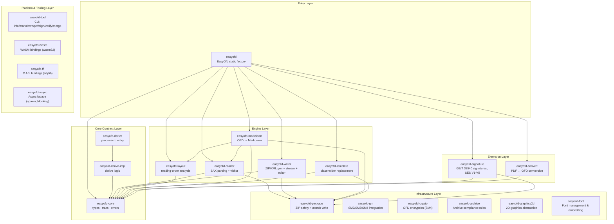
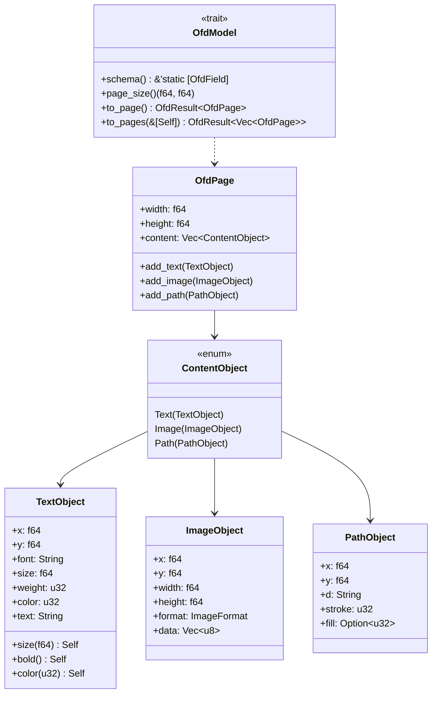
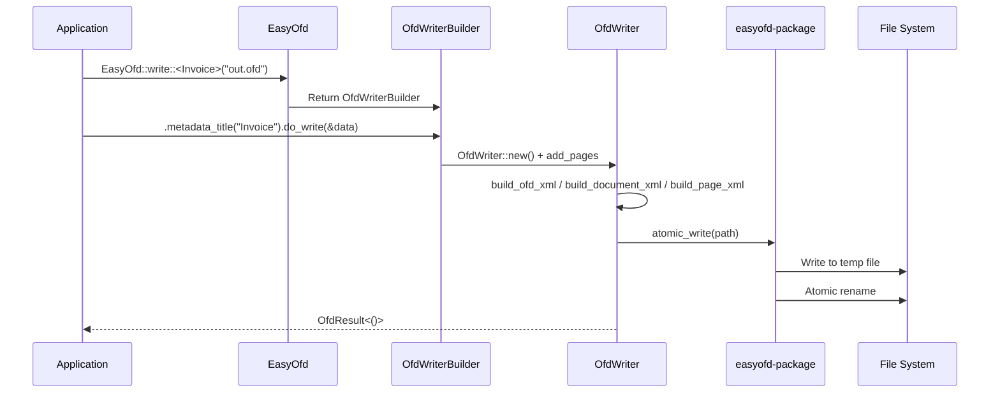
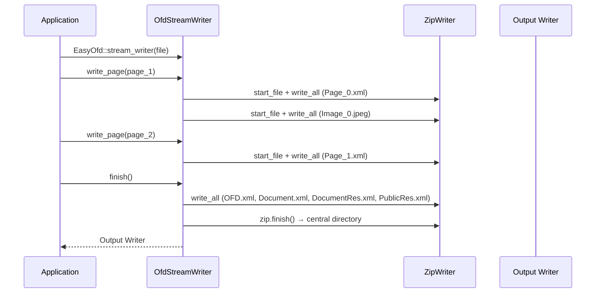
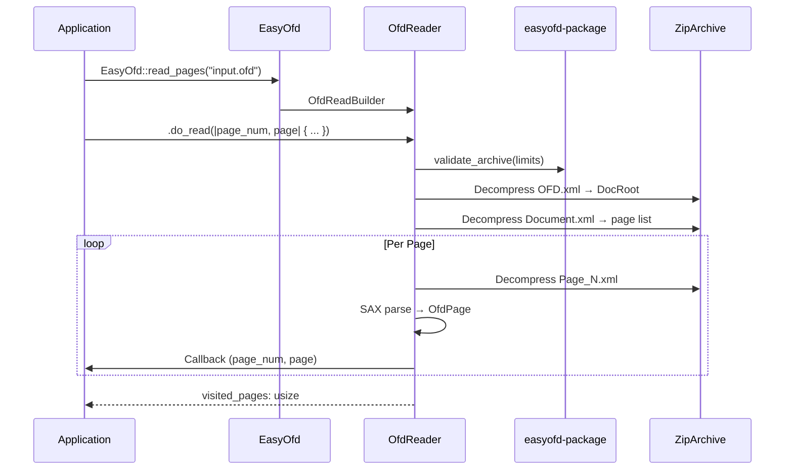
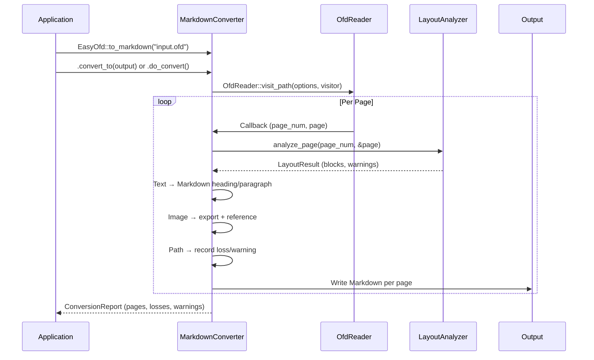

# easyofd-rust Architecture Document

> **Purpose**: Define the architecture goals, boundaries, component responsibilities, core flows, data models, and quality constraints for easyofd-rust, so that design, development, testing, and release use the same verifiable architecture contract.
>
> **Architecture Version**: 0.1.1<br>
> **Status**: Approved<br>
> **Owner**: easyofd-rust team<br>
> **Last Updated**: 2026-08-21

## Table of Contents

1. [Document Control](#1-document-control)
2. [Executive Summary](#2-executive-summary)
3. [Drivers, Constraints & Non-Goals](#3-drivers-constraints--non-goals)
4. [Scope & Boundaries](#4-scope--boundaries)
5. [Current State, Target State & Gaps](#5-current-state-target-state--gaps)
6. [Architecture Principles](#6-architecture-principles)
7. [Overall Architecture](#7-overall-architecture)
8. [Components & Dependencies](#8-components--dependencies)
9. [Core Flows](#9-core-flows)
10. [Data Model](#10-data-model)
11. [API Design](#11-api-design)
12. [Security & Reliability](#12-security--reliability)
13. [Performance](#13-performance)
14. [Testing & Quality Gates](#14-testing--quality-gates)
15. [Risks, Debt & Roadmap](#15-risks-debt--roadmap)
16. [Appendix](#16-appendix)

---

## 1. Document Control

### 1.1 Document Info

| Field | Value |
|---|---|
| Project | easyofd-rust |
| Version | 0.1.1 |
| Applicable Code | workspace edition 2024, resolver 3, rust-version 1.88 |
| Form Factor | Rust library / Cargo workspace |
| License | Apache-2.0 |

### 1.2 Reader Paths

| Reader | Priority Sections | Expected Outcome |
|---|---|---|
| Developers | 2, 7–11 | Module boundaries, API contracts, data flow |
| Testers | 9, 12–14 | Core flows, error paths, quality gates |
| Integrators | 2, 4, 11 | Usage boundaries, public interfaces, limits |
| Architecture Reviewers | 3, 5–7 | Drivers, principles, layering, gaps |

### 1.3 Status Labels

| Label | Definition |
|---|---|
| ✅ Implemented | Current code and tests verifyable |
| ⚠️ Experimental | API exists but core logic is stub |
| 🗓️ Planned | No callable implementation yet |

---

## 2. Executive Summary

### 2.1 One-Line Architecture

**easyofd-rust is a pure-Rust OFD document library that converts structured data into GB/T 33190-2016 compliant OFD files through Builder patterns and compile-time derive macros, with safe reading, page-by-page streaming, template filling, editing, and OFD → Markdown conversion.**

### 2.2 At a Glance

```text
Rust Application / Service
        │ cargo add easyofd
        ▼
┌─────────────────────────────────────────────────────────────┐
│ easyofd (facade)                                            │
│ EasyOfd::write / read / to_markdown / fill_template         │
├─────────────────────────────────────────────────────────────┤
│ easyofd-core        Types, traits, errors, data model       │
│ easyofd-derive      #[derive(OfdModel)] compile-time        │
│ easyofd-writer      ZIP/XML gen + stream writer + editor    │
│ easyofd-reader      SAX parsing + page visitor              │
│ easyofd-package     ZIP safety + atomic write               │
│ easyofd-layout      Deterministic reading-order analysis    │
│ easyofd-markdown    OFD → Markdown + loss report            │
│ easyofd-template    {placeholder} replacement engine        │
│ easyofd-signature   GB/T 38540 signatures, SES V1-V5        │
│ easyofd-convert     PDF ↔ OFD conversion (implemented)      │
└─────────────────────────────────────────────────────────────┘
        │
        ▼
OFD File (GB/T 33190-2016 ZIP) / Markdown Text
```

### 2.3 Core Value

| Dimension | Promise |
|---|---|
| Safety | `#![forbid(unsafe_code)]` workspace-wide, ZIP bomb protection, path traversal validation |
| Ease of Use | One-line `EasyOfd::write::<T>()` to generate OFD, fluent Builder chain |
| Performance | Streaming Writer doesn't retain all pages, SAX per-page parsing, per-page Markdown output |
| Compliance | GB/T 33190-2016 XML namespaces, GB/T 38540 digital signatures (SM2WithSM3, SES V1/V4/V5) |

---

## 3. Drivers, Constraints & Non-Goals

### 3.1 Architecture Drivers

| ID | Driver | Priority | Verification |
|---|---|:---:|---|
| D-001 | Zero unsafe, workspace-wide `#![forbid(unsafe_code)]` | P0 | Compile check |
| D-002 | Builder pattern + compile-time derive macro, one-line OFD generation | P0 | Integration tests |
| D-003 | GB/T 33190-2016 compliant ZIP output | P0 | ZIP structure tests |
| D-004 | Streaming: large files without full memory load | P1 | Benchmark |
| D-005 | OFD → Markdown deterministic conversion + visible losses | P1 | Conversion tests |
| D-006 | Single error type `OfdError`, workspace-wide | P0 | Error tests |

### 3.2 Hard Constraints

| ID | Constraint | Verification |
|---|---|---|
| C-001 | No `unsafe` | `#![forbid(unsafe_code)]` compile-time |
| C-002 | MSRV ≥ Rust 1.88, Edition 2024 | CI MSRV job |
| C-003 | No C/C++ FFI dependencies | Dependency audit |
| C-004 | ZIP entries ≤ 20,000, total uncompressed ≤ 1 GB | `PackageLimits` validation |

### 3.3 Non-Goals

- PDF rendering (delegated to external libraries)
- OFD visual rendering
- Markdown → OFD reverse conversion

---

## 4. Scope & Boundaries

### 4.1 System Responsibility

| System Responsible | System NOT Responsible | External Alternative |
|---|---|---|
| OFD file creation (text, images, paths) | PDF rendering | lopdf / printpdf |
| Safe OFD reading | OFD visual rendering | OFD readers |
| Template placeholder replacement | Certificate management | PKI infrastructure |
| OFD → Markdown conversion | Markdown → OFD reverse | Out of scope |
| GB/T 38540 digital signatures (SM2WithSM3, SES V1/V4/V5) | Certificate management | PKI infrastructure |
| SM4 encryption (CBC/ECB) | | |
| PDF ↔ OFD conversion | | |

### 4.2 External Dependencies

| Dependency | Purpose | Version |
|---|---|---|
| `zip` | ZIP read/write (deflate) | 8.6.0 |
| `quick-xml` | SAX XML parsing and generation | 0.41.0 |
| `chrono` | Document timestamps | 0.4.45 |
| `thiserror` | Error derive macro | 2.0.18 |
| `syn` / `quote` / `proc-macro2` | Derive macro compilation | 3.x / 1.x |

---

## 5. Current State, Target State & Gaps

### 5.1 Current Implementation

| Capability | Implementation | Status | Evidence |
|---|---|---|---|
| OFD Creation | `easyofd-writer` + `OfdWriter` + `OfdStreamWriter` | ✅ Implemented | 62 unit tests |
| Derive Macro | `easyofd-derive` + `easyofd-derive-impl` | ✅ Implemented | 34 tests + 2 compile-fail |
| OFD Reading | `easyofd-reader` + SAX parsing + visitor pattern | ✅ Implemented | 12 tests |
| Package Safety | `easyofd-package` + ZIP limits + atomic write | ✅ Implemented | 6 tests |
| Layout Analysis | `easyofd-layout` deterministic reading order | ✅ Implemented | 3 tests |
| OFD → Markdown | `easyofd-markdown` streaming conversion + loss report | ✅ Implemented | 10 tests |
| Template Fill | `easyofd-template` {key} replacement | ✅ Implemented | 2 tests |
| Editor | `OfdEditor` open → modify → save | ✅ Implemented | 4 tests |
| Electronic Seal | `easyofd-signature` + SM2WithSM3 + SES V1/V4/V5 + checkSealMatch + PKCS#12 | ✅ Implemented | gbt38540_full_pipeline tests passing |
| PDF ↔ OFD | `easyofd-convert` (lopdf + printpdf) | ✅ Implemented | PDF ↔ OFD conversion with fidelity |
| Stream Writer | `OfdStreamWriter` page-by-page writing | ✅ Implemented | 1 test |

### 5.2 Gap Matrix

| Gap | Current | Target | Priority |
|---|---|---|:---:|
| Digital signature cryptography | SM2WithSM3 real signing + SES V1/V4/V5 | RSA signing + complete cert chain verification | P5 |
| PDF → OFD conversion | Implemented (lopdf) | Full conversion pipeline | ✅ Done |
| OFD → PDF conversion | Implemented (printpdf) | Full rendering pipeline | ✅ Done |
| Font embedding | Font resource generation + FontLoader | Complete font subsetting | P2 |
| OCR fallback | OcrProvider trait | External OCR integration | P3 |

---

## 6. Architecture Principles

### 6.1 Principles

| Principle | Meaning | Engineering Rule |
|---|---|---|
| Zero unsafe | Safety is a compile-time constraint | `#![forbid(unsafe_code)]` workspace-wide |
| Single entry | `EasyOfd` static factory | All operations via `EasyOfd::write/read/to_markdown/fill_template` |
| Builder pattern | Fluent chain configuration | `mut self → Self` + `#[must_use]` |
| Compile-time reflection | Derive macro replaces runtime scanning | `#[derive(OfdModel)]` zero runtime cost |
| Separation of concerns | Each crate has one job | Core doesn't depend on Facade |
| Single error type | Workspace-wide unified error | `OfdError` enum + `type OfdResult<T>` |
| Streaming first | Large files don't load entirely | Writer writes page-by-page, Reader visits page-by-page |

### 6.2 Key Decisions

| ADR | Decision | Rationale |
|---|---|---|
| ADR-001 | 21-crate workspace split | Responsibility isolation, independent compilation, optional dependencies |
| ADR-002 | SAX parsing over DOM | Memory efficiency, large file friendly |
| ADR-003 | `OfdWriter` + `OfdStreamWriter` dual Writer | Batch uses Writer, streaming uses StreamWriter |
| ADR-004 | Layout analyzer as independent crate | Deterministic, testable, replaceable |
| ADR-005 | `OfdEditor` supports open → edit → save | Avoids full rewrite |

---

## 7. Overall Architecture

### 7.1 Layered View



### 7.2 Dependency Direction Rules

- **Core never depends on any engine or Facade**
- **Facade depends on all engines; engines don't depend on each other** (except Markdown which depends on Reader and Layout)
- **All crates depend on Core**
- **Package is infrastructure, shared by Reader, Writer, Template, Markdown, Signature**

---

## 8. Components & Dependencies

### 8.1 Crate Map

| Crate | Lines | Responsibility | Key Public Types |
|---|---:|---|---|
| `easyofd` | 504 | Facade + Builders + re-exports | `EasyOfd`, `OfdWriterBuilder`, `PageWriterBuilder`, `OfdReadBuilder` |
| `easyofd-core` | 612 | Types, traits, errors, data model | `OfdPage`, `TextObject`, `ImageObject`, `PathObject`, `OfdModel`, `OfdError` |
| `easyofd-derive` | 6 | proc-macro thin entry | `#[derive(OfdModel)]` |
| `easyofd-derive-impl` | 400 | All derive logic | `derive_ofd_model_impl` |
| `easyofd-reader` | 844 | SAX parsing + page visitor | `OfdReader`, `ReadOptions`, `ResourceEntry` |
| `easyofd-writer` | 1440 | ZIP/XML gen + stream + editor | `OfdWriter`, `OfdStreamWriter`, `OfdEditor`, `WriteOptions`, `EmbeddedFont` |
| `easyofd-package` | 280 | ZIP safety + atomic write | `PackageLimits`, `validate_archive`, `atomic_write` |
| `easyofd-layout` | 159 | Deterministic reading-order | `LayoutAnalyzer`, `LayoutBlock`, `LayoutOptions` |
| `easyofd-markdown` | 307 | OFD → Markdown streaming | `MarkdownConverter`, `MarkdownOptions`, `ConversionReport` |
| `easyofd-template` | 160 | {placeholder} replacement | `OfdTemplateFiller` |
| `easyofd-signature` | — | GB/T 38540 signatures, SES V1-V5, seal verification | `OfdSignatureBuilder`, `ElectronicSeal`, `SignedOfd` |
| `easyofd-convert` | — | PDF ↔ OFD conversion (lopdf + printpdf) | `pdf_to_ofd`, `ofd_to_pdf`, `ConvertOptions` |
| `easyofd-gm` | — | SM2/SM3/SM4 integration (GM algorithms) | SM2 cipher, SM3 hash, SM4 cipher |
| `easyofd-crypto` | — | OFD encryption infrastructure (SM4, PKCS#12) | SM4-CBC/ECB encryption, key management |
| `easyofd-archive` | — | Archive compliance rules engine | Compliance checks, integrity verification |
| `easyofd-graphics2d` | — | 2D graphics abstraction (ofdrw-graphics2d) | Canvas drawing, vector paths |
| `easyofd-font` | — | Font management & embedding | Font resource generation, FontLoader |
| `easyofd-tool` | — | CLI: info / to-markdown / to-pdf / sign / verify / pages / merge | Command-line interface |
| `easyofd-wasm` | — | WASM bindings for browser-side reading (wasm32) | Browser integration |
| `easyofd-ffi` | — | C ABI bindings (15 functions, cdylib) | FFI interface |
| `easyofd-async` | — | Async facade (spawn_blocking bridge) | Async wrapper |

### 8.2 Core Data Model



### 8.3 OfdError Variants

| Variant | Semantics | Typical Source |
|---|---|---|
| `Io` | File/network I/O error | Reader, Writer |
| `Zip` | ZIP format error | Decompression failure, entry corruption |
| `Xml` | XML parsing error | OFD XML format anomaly |
| `InvalidDocument` | Invalid document structure | Missing DocRoot, path traversal |
| `Resource` | Missing or malformed resource | Image reference not found |
| `Model` | Derive model conversion failure | `OfdModel::to_page` |
| `Conversion` | Format conversion error | Markdown, PDF conversion |

---

## 9. Core Flows

### 9.1 OFD Creation Flow



### 9.2 Streaming Write Flow



### 9.3 OFD Reading Flow



### 9.4 OFD → Markdown Flow



---

## 10. Data Model

### 10.1 OFD ZIP File Structure

```text
output.ofd (ZIP, deflate)
├── OFD.xml                          ← Entry point: DocRoot reference
└── Doc_0/
    ├── Document.xml                 ← Document structure: page list
    ├── DocumentRes.xml              ← Document resources: image/font refs
    ├── PublicRes.xml                ← Public resources: page sizes
    ├── Pages/
    │   ├── Page_0.xml               ← Page content: text/image/path objects
    │   ├── Page_1.xml
    │   └── ...
    └── Res/
        ├── Image_0.jpeg             ← Image resources
        ├── Image_1.png
        └── ...
```

### 10.2 Page Content Mapping

| Rust Type | OFD XML Element | Key Attributes |
|---|---|---|
| `TextObject` | `<TextObject>` | Boundary, Font, Size, Weight, FillColor, TextCode |
| `ImageObject` | `<ImageObject>` | Boundary, ResourceID |
| `PathObject` | `<PathObject>` | Boundary, AbbreviatedData, StrokeColor, FillColor |

### 10.3 Resource Management

- Writer assigns `Image_N.{ext}` resource names per image, registers in `DocumentRes.xml`
- Reader maps ResourceID to ZIP entry paths via `ResourceEntry` index
- Streaming Writer writes images to ZIP immediately on `write_page`, no memory copy retained

---

## 11. API Design

### 11.1 Creation API

```rust
// 1. Derive macro — zero runtime cost
#[derive(OfdModel)]
#[ofd(page_width = 210.0, page_height = 297.0)]
struct Invoice {
    #[ofd(x = 20.0, y = 30.0, size = 18.0, bold)]
    title: String,
    #[ofd(x = 20.0, y = 50.0)]
    amount: String,
}
EasyOfd::write::<Invoice>("out.ofd").do_write(&data)?;

// 2. Manual construction
let mut page = OfdPage::new(210.0, 297.0);
page.add_text(TextObject::new(20.0, 30.0, "Hello").size(18.0).bold());
EasyOfd::write_pages_to("out.ofd", vec![page])?;

// 3. Streaming
let mut writer = EasyOfd::stream_writer(file);
writer.write_page(page)?;
writer.finish()?;
```

### 11.2 Reading API

```rust
// Full read
let reader = OfdReader::open("input.ofd")?;
let texts = reader.extract_all_text();

// Page visitor (no retained processed pages)
EasyOfd::read_pages("input.ofd")
    .page_range(1, 10)
    .do_read(|page_num, page| { Ok(()) })?;
```

### 11.3 Conversion API

```rust
// In-memory
let result = EasyOfd::to_markdown("input.ofd").do_convert()?;

// Streaming to file
EasyOfd::to_markdown("input.ofd")
    .image_policy(ImagePolicy::ExportTo("images/".into()))
    .convert_to(File::create("output.md")?)?;
```

### 11.4 Template API

```rust
let mut data = HashMap::new();
data.insert("name".into(), "Alice".into());
data.insert("amount".into(), "$1,234.00".into());
EasyOfd::fill_template("template.ofd", &data)?.save("output.ofd")?;
```

---

## 12. Security & Reliability

### 12.1 ZIP Safety

| Protection | Default Limit | Implementation |
|---|---|---|
| Entry count | ≤ 20,000 | `PackageLimits::max_entries` |
| Total uncompressed | ≤ 1 GB | `max_total_uncompressed_size` |
| Single entry size | ≤ 256 MB | `max_entry_uncompressed_size` |
| Compression ratio | ≤ 1000:1 | `max_compression_ratio` |
| Path traversal | Blocked `..`, absolute paths | `validate_entry_name` |

### 12.2 Atomic Write

Writer and Template use `atomic_write`: write to same-directory temp file, then `rename` to replace target, avoiding corruption on interrupted writes.

### 12.3 unsafe Policy

Workspace-wide `#![forbid(unsafe_code)]`, compile-time forbids any unsafe code. All dependencies (`zip`, `quick-xml`) are pure Rust.

---

## 13. Performance

### 13.1 Design Strategy

| Scenario | Strategy | Effect |
|---|---|---|
| Large file writing | `OfdStreamWriter` per-page ZIP write | Memory only holds page descriptors + resource directory |
| Large file reading | `OfdReader::visit_path` SAX per-page | No retained processed pages |
| Large file → Markdown | `convert_path_to` per-page streaming | Incremental write, no full string construction |
| Image resources | Streaming Writer writes to ZIP on page write | No memory accumulation |

### 13.2 Benchmark

Built-in benchmark example:

```bash
cargo run --release -p easyofd --example benchmark -- 10000
```

Output JSON: pages, input_bytes, visited_pages, text_bytes, read_millis, markdown_millis.

---

## 14. Testing & Quality Gates

### 14.1 Test Matrix

| Crate | Unit Tests | Compile-fail | Total |
|---|---:|---:|---:|
| easyofd-core | — | — | — |
| easyofd-derive-impl | — | 2 | — |
| easyofd-reader | — | — | — |
| easyofd-writer | — | — | — |
| easyofd-package | — | — | — |
| easyofd-layout | — | — | — |
| easyofd-markdown | — | — | — |
| easyofd-template | — | — | — |
| easyofd-signature | — | — | — |
| easyofd-convert | — | — | — |
| easyofd-gm | — | — | — |
| easyofd-crypto | — | — | — |
| easyofd-archive | — | — | — |
| easyofd-graphics2d | — | — | — |
| easyofd-font | — | — | — |
| easyofd-tool | — | — | — |
| easyofd-wasm | — | — | — |
| easyofd-ffi | — | — | — |
| easyofd-async | — | — | — |
| easyofd (facade) | — | — | — |
| **Total** | **2858** | **2** | **2860** |

### 14.2 Quality Gates

| Gate | Configuration |
|---|---|
| Clippy | `pedantic` = warn, `module_name_repetitions` = allow |
| unsafe | `#![forbid(unsafe_code)]` |
| missing_docs | `warn` |
| trybuild | 2 compile-fail cases for derive macro error messages |

---

## 15. Risks, Debt & Roadmap

### 15.1 Risks

| Risk | Impact | Mitigation |
|---|---|---|
| OFD spec complexity exceeds expectations | Some elements unsupported | Incremental version expansion, transparent loss reporting |
| Signature crypto dependency | Introduces C/C++ dependency | Pure-Rust SM2 implementation (sm2/sm3 crates) |
| PDF conversion precision | Layout loss | Clear limitations, provide loss report |

### 15.2 Roadmap

| Version | Milestone | Status |
|---|---|:---:|
| v0.1.0 | Initial crates.io release (facade + core) | ✅ published 2026-08-10 |
| v0.1.1 | Full 21-crate workspace: signatures, encryption, PDF, merge, WASM/FFI/async; byte-level ofdrw parity | ✅ published 2026-08-21 |

---

## 16. Appendix

### 16.1 GB/T 33190-2016 Compliance

- OFD.xml namespace: `http://www.ofdspec.org/2016`
- Document.xml uses `<ofd:Page>` references
- Text objects use `<ofd:TextObject>` + `<ofd:TextCode>`
- Image objects use `<ofd:ImageObject>` + ResourceID references

### 16.2 Design Comparison with easyexcel-rs

| easyexcel-rs Concept | easyofd-rust Equivalent |
|---|---|
| `ExcelRow` trait | `OfdModel` trait |
| `#[derive(ExcelRow)]` | `#[derive(OfdModel)]` |
| `EasyExcel::write()` | `EasyOfd::write()` |
| Sheet-based output | Page-based output |
| `ExcelReader` | `OfdReader` |
| `FillExcelTemplate` | `OfdTemplateFiller` |

### 16.3 Related Documents

| Document | Purpose |
|---|---|
| [easyofd-rust-Architecture.zh_CN.md](easyofd-rust-Architecture.zh_CN.md) | Chinese architecture document |
| [README.md](../README.md) | English project entry |
| [README.zh-CN.md](../README.zh-CN.md) | Chinese project entry |
| [usage-guide.md](usage-guide.md) | Usage guide |
