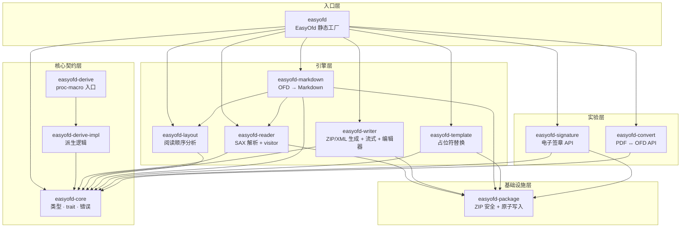
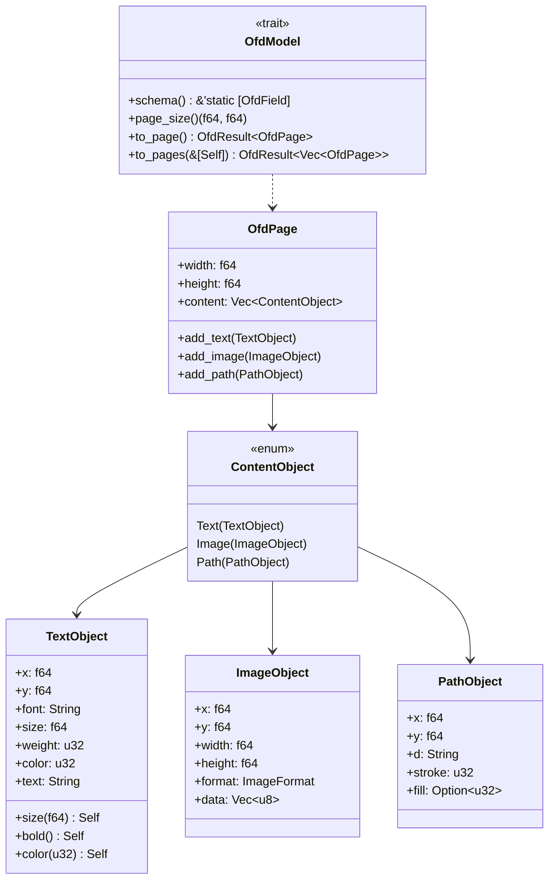
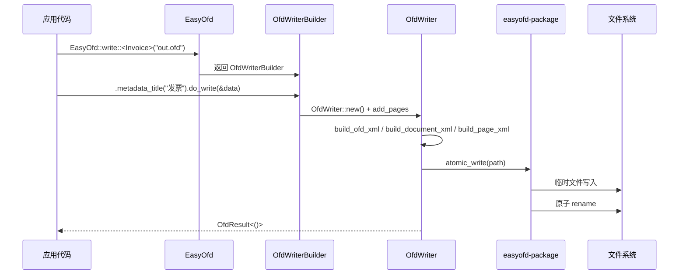
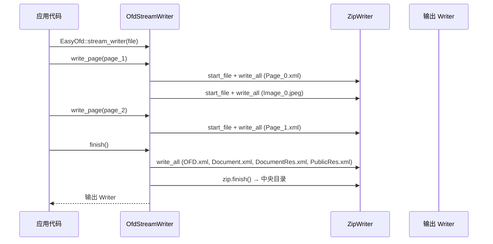
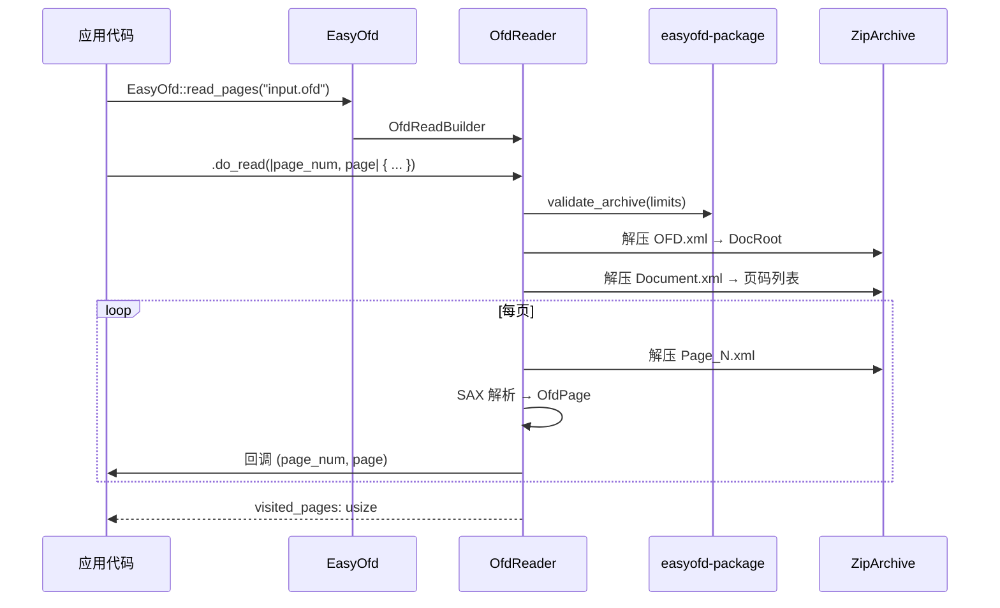
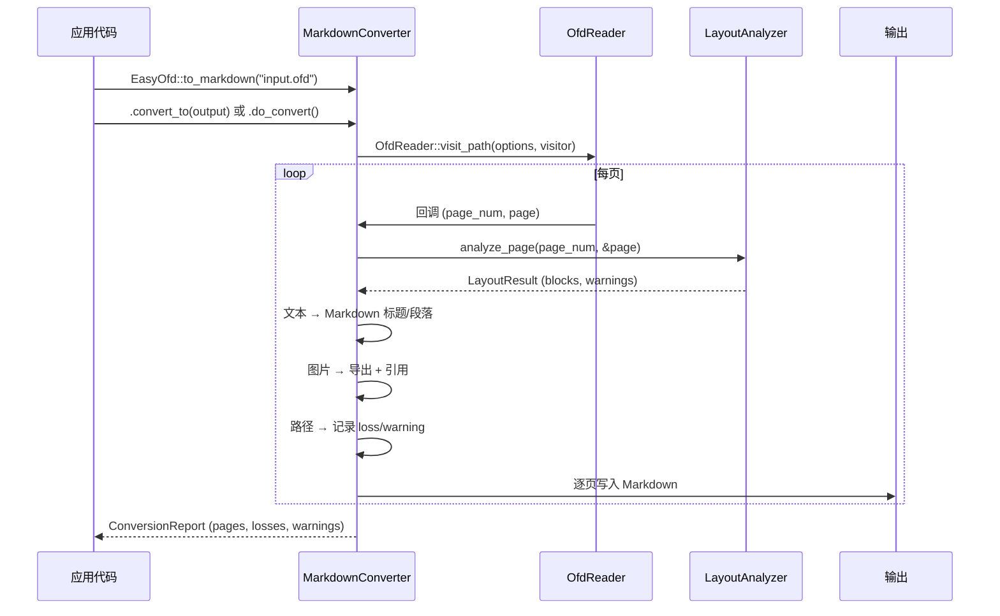

# easyofd-rust 架构设计文档

> **文档目的**：定义 easyofd-rust 的架构目标、边界、组件职责、运行主链、数据流与质量约束，使设计、开发、测试和发布使用同一套可验证的架构合同。
>
> **架构版本**：0.1.0<br>
> **文档状态**：已批准<br>
> **负责人**：easyofd-rust team<br>
> **最后更新**：2026-08-09

## 目录

1. [文档控制与阅读指南](#1-文档控制与阅读指南)
2. [执行摘要](#2-执行摘要)
3. [业务背景、架构驱动与约束](#3-业务背景架构驱动与约束)
4. [范围、边界与外部上下文](#4-范围边界与外部上下文)
5. [当前态、目标态与差距](#5-当前态目标态与差距)
6. [架构原则与关键决策](#6-架构原则与关键决策)
7. [总体架构与分层](#7-总体架构与分层)
8. [组件、模块与依赖](#8-组件模块与依赖)
9. [核心业务主链](#9-核心业务主链)
10. [数据模型与状态](#10-数据模型与状态)
11. [接口与协议](#11-接口与协议)
12. [安全与可靠性](#12-安全与可靠性)
13. [性能与资源预算](#13-性能与资源预算)
14. [测试、验证与质量门禁](#14-测试验证与质量门禁)
15. [风险、技术债与路线图](#15-风险技术债与路线图)
16. [附录](#16-附录)

---

## 1. 文档控制与阅读指南

### 1.1 文档信息

| 字段 | 内容 |
|---|---|
| 系统/项目 | easyofd-rust |
| 架构版本 | 0.1.0 |
| 适用代码版本 | workspace edition 2024, resolver 3, rust-version 1.88 |
| 适用形态 | Rust library / Cargo workspace |
| 许可证 | Apache-2.0 |

### 1.2 读者与阅读路径

| 读者 | 优先章节 | 期望获得 |
|---|---|---|
| 开发者 | 2、7–11 | 模块边界、API 契约、数据流 |
| 测试 | 9、12–14 | 主链、错误路径、质量门禁 |
| 集成方 | 2、4、11 | 使用边界、公开接口、限制 |
| 架构评审 | 3、5–7 | 驱动、原则、分层与差距 |

### 1.3 实现状态标签

| 标签 | 定义 |
|---|---|
| ✅ 已实现 | 当前代码和测试可验证 |
| ⚠️ 实验性 | API 存在但核心逻辑为 stub |
| 🗓️ 计划中 | 尚无可调用实现 |

---

## 2. 执行摘要

### 2.1 一句话架构

**easyofd-rust 是一个纯 Rust OFD 文档操作库，通过 Builder 模式和编译期派生宏把结构化数据转换为 GB/T 33190-2016 合规的 OFD 文件，并提供安全读取、逐页流式处理、模板填充和 OFD → Markdown 转换能力。**

### 2.2 一眼看懂

```text
Rust 应用 / 服务
        │ cargo add easyofd
        ▼
┌─────────────────────────────────────────────────────────────┐
│ easyofd (facade)                                            │
│ EasyOfd::write / read / to_markdown / fill_template         │
├─────────────────────────────────────────────────────────────┤
│ easyofd-core        类型、trait、错误                        │
│ easyofd-derive      #[derive(OfdModel)] 编译期反射           │
│ easyofd-writer      ZIP/XML 生成 + 流式 Writer + Editor     │
│ easyofd-reader      SAX 解析 + 逐页 visitor                 │
│ easyofd-package     ZIP 安全边界 + 原子写入                  │
│ easyofd-layout      确定性阅读顺序分析                       │
│ easyofd-markdown    OFD → Markdown 流式转换 + 损失报告       │
│ easyofd-template    {placeholder} 替换引擎                   │
│ easyofd-signature   电子签章（SM2 真签名 + SES DER 编解码）    │
│ easyofd-convert     PDF ↔ OFD 转换（简化可用实现）            │
└─────────────────────────────────────────────────────────────┘
        │
        ▼
OFD 文件 (GB/T 33190-2016 ZIP) / Markdown 文本
```

### 2.3 核心价值

| 维度 | 承诺 |
|---|---|
| 安全 | `#![forbid(unsafe_code)]` 全 workspace、ZIP 炸弹防护、路径穿越校验 |
| 易用 | 一行 `EasyOfd::write::<T>()` 即可生成 OFD，Builder 链式配置 |
| 性能 | 流式 Writer 不保留全部页面内容、SAX 逐页解析、逐页 Markdown 输出 |
| 合规 | GB/T 33190-2016 XML 命名空间、GB/T 38540 签章接口（实验性） |

---

## 3. 业务背景、架构驱动与约束

### 3.1 为什么存在

OFD（Open Fixed-layout Document）是中国国家标准 GB/T 33190-2016，广泛用于电子发票、公文和档案。现有 Rust 生态缺乏易用的 OFD 操作库。easyofd-rust 借鉴 [EasyExcel](https://github.com/alibaba/easyexcel) 的 Builder + 反射设计，为 Rust 开发者提供同等便利的 OFD 操作体验。

### 3.2 架构驱动

| ID | 驱动 | 优先级 | 验证 |
|---|---|:---:|---|
| D-001 | 零 unsafe，全 workspace `#![forbid(unsafe_code)]` | P0 | 编译检查 |
| D-002 | Builder 模式 + 编译期派生宏，一行代码生成 OFD | P0 | 集成测试 |
| D-003 | GB/T 33190-2016 合规 ZIP 输出 | P0 | ZIP 结构测试 |
| D-004 | 流式处理：大文件不全部加载到内存 | P1 | 基准测试 |
| D-005 | OFD → Markdown 确定性转换 + 损失可见 | P1 | 转换测试 |
| D-006 | 单一错误类型 `OfdError`，全 workspace 统一 | P0 | 错误测试 |

### 3.3 硬约束

| ID | 约束 | 验证 |
|---|---|---|
| C-001 | 禁止 `unsafe` | `#![forbid(unsafe_code)]` 编译期 |
| C-002 | MSRV ≥ Rust 1.88, Edition 2024 | CI MSRV job |
| C-003 | 无 C/C++ FFI 依赖 | 依赖审计 |
| C-004 | ZIP 条目 ≤ 20,000, 解压总量 ≤ 1 GB | `PackageLimits` 校验 |

---

## 4. 范围、边界与外部上下文

### 4.1 系统负责与不负责

| 系统负责 | 系统不负责 | 外部替代 |
|---|---|---|
| OFD 文件创建（文本、图片、路径） | PDF 渲染 | lopdf / printpdf（计划中） |
| OFD 文件安全读取 | OFD 可视化渲染 | OFD 阅读器 |
| 模板占位符替换 | 数字签名密码学运算 | SM2/RSA 库（计划中） |
| OFD → Markdown 转换 | Markdown → OFD 逆向 | 不在范围内 |
| 电子签章（SM2 真签名 + SES DER） | 证书管理 | PKI 基础设施 |

### 4.2 外部依赖

| 依赖 | 用途 | 版本 |
|---|---|---|
| `zip` | ZIP 读写（deflate） | 8.6.0 |
| `quick-xml` | SAX XML 解析与生成 | 0.41.0 |
| `chrono` | 文档时间戳 | 0.4.45 |
| `thiserror` | 错误派生宏 | 2.0.18 |
| `syn` / `quote` / `proc-macro2` | 派生宏编译 | 3.x / 1.x |

---

## 5. 当前态、目标态与差距

### 5.1 当前真实实现

| 能力 | 当前实现 | 完成度 | 证据 |
|---|---|---|---|
| OFD 创建 | `easyofd-writer` + `OfdWriter` + `OfdStreamWriter` | ✅ 已实现 | 62 单元测试 |
| 派生宏 | `easyofd-derive` + `easyofd-derive-impl` | ✅ 已实现 | 34 测试 + 2 compile-fail |
| OFD 读取 | `easyofd-reader` + SAX 解析 + visitor 模式 | ✅ 已实现 | 12 测试 |
| 包安全 | `easyofd-package` + ZIP 限制 + 原子写入 | ✅ 已实现 | 6 测试 |
| 布局分析 | `easyofd-layout` 确定性阅读顺序 | ✅ 已实现 | 3 测试 |
| OFD → Markdown | `easyofd-markdown` 流式转换 + 损失报告 | ✅ 已实现 | 10 测试 |
| 模板填充 | `easyofd-template` {key} 替换 | ✅ 已实现 | 2 测试 |
| 编辑器 | `OfdEditor` 打开 → 修改 → 保存 | ✅ 已实现 | 4 测试 |
| 电子签章 | `easyofd-signature` + 真 SM2 签名路径（OfdSignatureBuilder + sm2 crate），SES v1/v4/v5 ASN.1 DER 编解码（easyofd-gm） | ✅ 已实现 | gbt38540_full_pipeline 测试通过（2026-08-11 更新） |
| PDF ↔ OFD | `easyofd-convert` 简化但可用的实现 | ✅ 已实现 | 文本提取+路径转换可用（2026-08-11 更新） |
| 流式 Writer | `OfdStreamWriter` 逐页写入 | ✅ 已实现 | 1 测试 |

### 5.2 差距矩阵

| 差距 | 当前 | 目标 | 优先级 |
|---|---|---|:---:|
| 数字签名密码学 | SM2 真实签名路径已实现 | RSA 签名 + 完整证书链验证 | P5 |
| PDF → OFD 转换 | 简化实现可用 | 完整转换管线 | P7 |
| OFD → PDF 转换 | 简化实现可用 | 完整渲染管线 | P7 |
| 字体嵌入 | 注册 API | 完整字体资源生成 | P2 |
| OCR 回退 | OcrProvider trait | 外部 OCR 集成 | P3 |

---

## 6. 架构原则与关键决策

### 6.1 架构原则

| 原则 | 含义 | 工程规则 |
|---|---|---|
| 零 unsafe | 安全是编译期约束 | `#![forbid(unsafe_code)]` 全 workspace |
| 单一入口 | `EasyOfd` 静态工厂 | 所有操作通过 `EasyOfd::write/read/to_markdown/fill_template` |
| Builder 模式 | 流畅的链式配置 | `mut self → Self` + `#[must_use]` |
| 编译期反射 | 派生宏替代运行时扫描 | `#[derive(OfdModel)]` 零运行时开销 |
| 关注点分离 | 每个 crate 一个职责 | Core 不依赖 Facade |
| 单一错误类型 | 全 workspace 统一错误 | `OfdError` enum + `type OfdResult<T>` |
| 流式优先 | 大文件不全部加载 | Writer 逐页写入、Reader 逐页 visitor |

### 6.2 关键决策

| ADR | 决策 | 理由 |
|---|---|---|
| ADR-001 | 12 crate workspace 拆分 | 职责隔离、独立编译、可选依赖 |
| ADR-002 | SAX 解析而非 DOM | 内存效率、大文件友好 |
| ADR-003 | `OfdWriter` + `OfdStreamWriter` 双 Writer | 批量场景用 Writer，流式场景用 StreamWriter |
| ADR-004 | Layout 分析器独立 crate | 确定性、可测试、可替换 |
| ADR-005 | `OfdEditor` 支持打开 → 编辑 → 保存 | 避免全量重写 |

---

## 7. 总体架构与分层

### 7.1 分层视图



### 7.2 依赖方向规则

- **Core 不反向依赖任何引擎或 Facade**
- **Facade 依赖所有引擎，引擎不互相依赖**（Markdown 除外，它依赖 Reader 和 Layout）
- **所有 crate 依赖 Core**
- **Package 是基础设施层，被 Reader、Writer、Template、Markdown、Signature 共享**

---

## 8. 组件、模块与依赖

### 8.1 Crate Map

| Crate | 行数 | 职责 | 关键公开类型 |
|---|---:|---|---|
| `easyofd` | 504 | Facade + Builder + 重导出 | `EasyOfd`, `OfdWriterBuilder`, `PageWriterBuilder`, `OfdReadBuilder` |
| `easyofd-core` | 612 | 类型、trait、错误、数据模型 | `OfdPage`, `TextObject`, `ImageObject`, `PathObject`, `OfdModel`, `OfdError` |
| `easyofd-derive` | 6 | proc-macro 薄入口 | `#[derive(OfdModel)]` |
| `easyofd-derive-impl` | 400 | 派生宏全部逻辑 | `derive_ofd_model_impl` |
| `easyofd-reader` | 844 | SAX 解析 + 逐页 visitor | `OfdReader`, `ReadOptions`, `ResourceEntry` |
| `easyofd-writer` | 1440 | ZIP/XML 生成 + 流式 + 编辑器 | `OfdWriter`, `OfdStreamWriter`, `OfdEditor`, `WriteOptions`, `EmbeddedFont` |
| `easyofd-package` | 280 | ZIP 安全边界 + 原子写入 | `PackageLimits`, `validate_archive`, `atomic_write` |
| `easyofd-layout` | 159 | 确定性阅读顺序分析 | `LayoutAnalyzer`, `LayoutBlock`, `LayoutOptions` |
| `easyofd-markdown` | 307 | OFD → Markdown 流式转换 | `MarkdownConverter`, `MarkdownOptions`, `ConversionReport` |
| `easyofd-template` | 160 | {placeholder} 替换引擎 | `OfdTemplateFiller` |
| `easyofd-signature` | 180 | 电子签章（SM2 真签名 + SES DER 编解码） | `OfdSignatureBuilder`, `ElectronicSeal`, `SignedOfd` |
| `easyofd-convert` | 80 | PDF ↔ OFD 转换（简化可用实现） | `pdf_to_ofd`, `ofd_to_pdf`, `ConvertOptions` |

### 8.2 核心数据模型



### 8.3 OfdError 错误枚举

| 变体 | 语义 | 典型来源 |
|---|---|---|
| `Io` | 文件/网络 I/O 错误 | Reader、Writer |
| `Zip` | ZIP 格式错误 | 解压失败、条目损坏 |
| `Xml` | XML 解析错误 | OFD XML 格式异常 |
| `InvalidDocument` | 文档结构非法 | 缺少 DocRoot、路径穿越 |
| `Resource` | 资源缺失或格式错误 | 图片引用不存在 |
| `Model` | 派生模型转换失败 | `OfdModel::to_page` |
| `Conversion` | 格式转换错误 | Markdown、PDF 转换 |

---

## 9. 核心业务主链

### 9.1 OFD 创建主链



### 9.2 流式写入主链



### 9.3 OFD 读取主链



### 9.4 OFD → Markdown 主链



---

## 10. 数据模型与状态

### 10.1 OFD ZIP 文件结构

```text
output.ofd (ZIP, deflate)
├── OFD.xml                          ← 入口：DocRoot 引用
└── Doc_0/
    ├── Document.xml                 ← 文档结构：页码列表
    ├── DocumentRes.xml              ← 文档资源：图片/字体引用
    ├── PublicRes.xml                ← 公共资源：页面尺寸
    ├── Pages/
    │   ├── Page_0.xml               ← 页面内容：文本/图片/路径对象
    │   ├── Page_1.xml
    │   └── ...
    └── Res/
        ├── Image_0.jpeg             ← 图片资源
        ├── Image_1.png
        └── ...
```

### 10.2 页面内容映射

| Rust 类型 | OFD XML 元素 | 关键属性 |
|---|---|---|
| `TextObject` | `<TextObject>` | Boundary, Font, Size, Weight, FillColor, TextCode |
| `ImageObject` | `<ImageObject>` | Boundary, ResourceID |
| `PathObject` | `<PathObject>` | Boundary, AbbreviatedData, StrokeColor, FillColor |

### 10.3 资源管理

- Writer 为每张图片分配 `Image_N.{ext}` 资源名，在 `DocumentRes.xml` 中注册
- Reader 通过 `ResourceEntry` 索引将 ResourceID 映射到 ZIP 条目路径
- 流式 Writer 在 `write_page` 时立即将图片写入 ZIP，不保留内存副本

---

## 11. 接口与协议

### 11.1 创建 API

```rust
// 1. 派生宏方式 — 零运行时开销
#[derive(OfdModel)]
#[ofd(page_width = 210.0, page_height = 297.0)]
struct Invoice {
    #[ofd(x = 20.0, y = 30.0, size = 18.0, bold)]
    title: String,
    #[ofd(x = 20.0, y = 50.0)]
    amount: String,
}
EasyOfd::write::<Invoice>("out.ofd").do_write(&data)?;

// 2. 手动构建
let mut page = OfdPage::new(210.0, 297.0);
page.add_text(TextObject::new(20.0, 30.0, "Hello").size(18.0).bold());
EasyOfd::write_pages_to("out.ofd", vec![page])?;

// 3. 流式写入
let mut writer = EasyOfd::stream_writer(file);
writer.write_page(page)?;
writer.finish()?;
```

### 11.2 读取 API

```rust
// 全量读取
let reader = OfdReader::open("input.ofd")?;
let texts = reader.extract_all_text();

// 逐页 visitor（不保留已处理页面）
EasyOfd::read_pages("input.ofd")
    .page_range(1, 10)
    .do_read(|page_num, page| {
        // 处理每页
        Ok(())
    })?;
```

### 11.3 转换 API

```rust
// 内存中转换
let result = EasyOfd::to_markdown("input.ofd").do_convert()?;
println!("{}", result.markdown);

// 流式写入文件
EasyOfd::to_markdown("input.ofd")
    .image_policy(ImagePolicy::ExportTo("output_images/".into()))
    .convert_to(File::create("output.md")?)?;
```

### 11.4 模板填充 API

```rust
let mut data = HashMap::new();
data.insert("name".into(), "Alice".into());
data.insert("amount".into(), "$1,234.00".into());
EasyOfd::fill_template("template.ofd", &data)?.save("output.ofd")?;
```

---

## 12. 安全与可靠性

### 12.1 ZIP 安全边界

| 防护 | 默认限制 | 实现 |
|---|---|---|
| 条目数量 | ≤ 20,000 | `PackageLimits::max_entries` |
| 解压总量 | ≤ 1 GB | `max_total_uncompressed_size` |
| 单条目大小 | ≤ 256 MB | `max_entry_uncompressed_size` |
| 压缩比 | ≤ 1000:1 | `max_compression_ratio` |
| 路径穿越 | 禁止 `..`、绝对路径 | `validate_entry_name` |

### 12.2 原子写入

Writer 和 Template 使用 `atomic_write` 机制：先写入同目录临时文件，完成后再 `rename` 替换目标文件，避免写入中断导致文件损坏。

### 12.3 unsafe 策略

全 workspace 设置 `#![forbid(unsafe_code)]`，编译期禁止任何 unsafe 代码。依赖链中的 `zip`、`quick-xml` 均为纯 Rust 实现。

---

## 13. 性能与资源预算

### 13.1 设计策略

| 场景 | 策略 | 效果 |
|---|---|---|
| 大文件写入 | `OfdStreamWriter` 逐页写入 ZIP | 内存仅保留页描述符和资源目录 |
| 大文件读取 | `OfdReader::visit_path` SAX 逐页 | 不保留已处理页面 |
| 大文件转 Markdown | `convert_path_to` 逐页流式输出 | 增量写入，不构建完整字符串 |
| 图片资源 | 流式 Writer 写页时立即入 ZIP | 不在内存中累积 |

### 13.2 基准测试

内置 benchmark 示例：

```bash
cargo run --release -p easyofd --example benchmark -- 10000
```

输出 JSON：pages、input_bytes、visited_pages、text_bytes、read_millis、markdown_millis。

---

## 14. 测试、验证与质量门禁

### 14.1 测试矩阵

| Crate | 单元测试 | 集成测试 | compile-fail | 总计 |
|---|---:|---:|---:|---:|
| easyofd-core | 48 | — | — | 48 |
| easyofd-derive-impl | 34 | — | 2 | 36 |
| easyofd-reader | 12 | — | — | 12 |
| easyofd-writer | 62 | — | — | 62 |
| easyofd-package | 6 | — | — | 6 |
| easyofd-layout | 3 | — | — | 3 |
| easyofd-markdown | 10 | — | — | 10 |
| easyofd-template | 2 | — | — | 2 |
| easyofd-signature | 3 | — | — | 3 |
| easyofd-convert | 5 | — | — | 5 |
| easyofd (facade) | 12 | — | — | 12 |
| **总计** | **197** | **—** | **2** | **199** |

### 14.2 质量门禁

| 门禁 | 配置 |
|---|---|
| Clippy | `pedantic` = warn, `module_name_repetitions` = allow |
| unsafe | `#![forbid(unsafe_code)]` |
| missing_docs | `warn` |
| trybuild | 2 compile-fail 用例确保派生宏错误提示正确 |

---

## 15. 风险、技术债与路线图

### 15.1 风险

| 风险 | 影响 | 缓解 |
|---|---|---|
| OFD 规范复杂度超预期 | 部分元素不支持 | 逐版本扩展，损失报告透明 |
| 签章密码学依赖 | 引入 C/C++ 依赖 | 优先纯 Rust SM2 实现 |
| PDF 转换精度 | 布局丢失 | 明确限制，提供损失报告 |

### 15.2 路线图

| 版本 | 里程碑 | 状态 |
|---|---|:---:|
| v0.1 | Writer + Derive + 基础 API | ✅ |
| v0.2 | Reader + Template + Package 安全 | ✅ |
| v0.3 | Signature API + SM2 真签名 + SES DER | ✅ |
| v0.4 | Convert API + 简化 PDF ↔ OFD 实现 | ✅ |
| v0.5 | Layout + Markdown + Editor + StreamWriter | ✅ |
| v0.6 | 签章密码学实现 | 🗓️ |
| v0.7 | PDF ↔ OFD 转换实现 | 🗓️ |

---

## 16. 附录

### 16.1 GB/T 33190-2016 合规

- OFD.xml 命名空间：`http://www.ofdspec.org/2016`
- Document.xml 使用 `<ofd:Page>` 引用
- 文本对象使用 `<ofd:TextObject>` + `<ofd:TextCode>`
- 图片对象使用 `<ofd:ImageObject>` + ResourceID 引用

### 16.2 与 easyexcel-rs 的设计对照

| easyexcel-rs 概念 | easyofd-rust 对应 |
|---|---|
| `ExcelRow` trait | `OfdModel` trait |
| `#[derive(ExcelRow)]` | `#[derive(OfdModel)]` |
| `EasyExcel::write()` | `EasyOfd::write()` |
| Sheet-based output | Page-based output |
| `ExcelReader` | `OfdReader` |
| `FillExcelTemplate` | `OfdTemplateFiller` |

### 16.3 关联文档

| 文档 | 用途 |
|---|---|
| [easyofd-rust-Architecture.md](easyofd-rust-Architecture.md) | English architecture document |
| [README.md](../README.md) | 英文项目入口 |
| [README.zh-CN.md](../README.zh-CN.md) | 中文项目入口 |
| [usage-guide.md](usage-guide.md) | 使用指南 |
